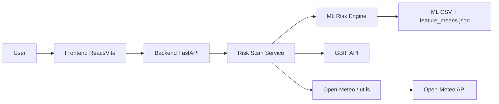

# Invasive Species Tracker

A **FARM stack** (FastAPI, React, MongoDB) application that assesses invasive species risk at any location: interactive map, location-based risk scan, species catalog and detail (iNaturalist, Wikipedia, Trefle), and a Hawaii case study with static charts and narrative.

---

## Table of Contents

- [Architecture](#architecture)
- [Repository Structure](#repository-structure)
- [Key Algorithms and Design](#key-algorithms-and-design)
- [Prerequisites](#prerequisites)
- [Environment and .env](#environment-and-env)
- [With Docker](#with-docker)
- [Without Docker](#without-docker)
- [Project Structure / Codebase Overview](#project-structure--codebase-overview)
- [Testing](#testing)
---

## Architecture

The app is built on the **FARM stack** (FastAPI, React, MongoDB): a FastAPI backend and a React (Vite) frontend. When you run a risk scan from the map, the frontend sends the chosen coordinates to the backend, which fetches climate data (rainfall, temperature) from Open-Meteo and derives a biome and soil pH for that location. That “dynamic profile” is compared against a plant dataset using risk scoring, while GBIF is queried to see which species are already recorded in the area. The API returns a ranked list of potential invaders—species that score high for the location but are *not* yet present in the GBIF radius—so the UI can highlight what might newly establish there. The ML dataset and feature means live in the repo under `notebooks/`; an optional species-by-location CSV can sit in `backend/app/db/`. MongoDB is available via Docker Compose but is not used in the current flow; data is served from CSV and in-memory DataFrames.




---

## Repository Structure

```
InvasiveSpeciesTracker/
├── backend/                 # FastAPI app
│   ├── app/
│   │   ├── api/v1/          # Routes: health, species, risk
│   │   ├── core/             # Config, utils (GBIF, rainfall, biome, soil pH)
│   │   ├── db/               # CSV and ML data loaders (in-memory)
│   │   ├── ml/               # Risk engine
│   │   ├── schemas/          # Pydantic request/response models
│   │   └── services/         # risk_scan: orchestrate GBIF + profile + risk_engine
│   ├── tests/
│   └── requirements.txt
├── frontend/                 # React 18 + Vite, Tailwind, shadcn-style UI
│   └── src/
│       ├── api/              # API client (risk scan, species, Trefle, iNat, Wikipedia)
│       ├── pages/             # Home2 (map, risk, species), HawaiiCaseStudy
│       └── components/ui/     # Shared UI components
├── notebooks/                # Risk inference and PCA analysis
│   ├── RiskScore.ipynb       # Risk model
│   ├── PCA.ipynb             # Feature analysis
│   ├── feature_means.json    # Used by risk engine to center dynamic profile
│   ├── plants_climate_4d.faiss # 4D FAISS vector index (Tracked via Git LFS)
│   ├── plants_metadata.csv   # Taxonomic metadata and traits (Tracked via Git LFS)
│   └── add_inat_taxon_ids.py # Script to attach iNaturalist taxon IDs
├── infra/
│   └── docker-compose.yml    # MongoDB
├── Dockerfile                # Backend + notebooks image
└── Makefile                 # mongo-up, mongo-down, api, test
```

---

## Key Algorithms and Design

- **Hybrid Risk Engine (FAISS Vector Search)**  
The backend utilizes a 4D **Facebook AI Similarity Search (FAISS)** index (`plants_climate_4d.faiss`) to instantly evaluate climate suitability across 96,270 species. The engine normalizes four core features (`growth_ph_minimum`, `growth_ph_maximum`, `growth_minimum_precipitation_mm`, `native_region_count`), centers the dynamic profile using global means, and queries the vector space to catch perfect climate matches as well as highly adaptable "generalist" sleepers. See [backend/app/ml/risk_engine.py](backend/app/ml/risk_engine.py).

- **Biological Aggression (Taxonomic Math)**  
Climate scores (Axis Y) are combined with Biological Aggression scores (Axis X). Aggression is calculated dynamically on the fly using `plants_metadata.csv`. This applies a **Genus Kicker** (mathematically penalizing plants related to known invaders), individual invasive flags, and rapid growth traits to elevate biologically lethal plants even if their climate match isn't 100% perfect.

- **Dynamic Profile & GBIF Orchestration**  
For a given `(lat, lng)`, the backend fetches rainfall and temperature from **Open-Meteo**, derives a **biome**, and estimates **soil pH**. Simultaneously, the **GBIF API** is queried for species already occurring in that radius. The final payload flags or filters species already present, allowing the UI to prioritize *potential new* invaders.

- **Subspecies Deduplicator & Smart Payload**  
To maintain high performance and UI clarity while processing 96k species, the engine strips out redundant subspecies clones. Instead of sending massive, browser-crashing arrays, the backend returns a scalable **Dashboard Object** containing total risk counts, frequency distribution, and a targeted top-threat list.

---

## Prerequisites

- **With Docker:** [Docker](https://docs.docker.com/get-docker/) and Docker Compose (runs backend, frontend, and MongoDB).
- **Without Docker:** **Python 3.10+** (3.11 recommended), **Node.js**, and **MongoDB** (installed and running locally; default `mongodb://localhost:27017`).

---

## Environment and .env

### Backend

Copy the example env and edit as needed:

```bash
cp backend/.env.example backend/.env
```

Relevant variables (see [backend/app/core/config.py](backend/app/core/config.py)):


| Variable           | Description                                                                                                |
| ------------------ | ---------------------------------------------------------------------------------------------------------- |
| `APP_NAME`         | API title (default: Invasive Tracker API)                                                                  |
| `ENV`              | e.g. `dev`                                                                                                 |
| `API_V1_PREFIX`    | API prefix (default: `/api/v1`)                                                                            |
| `CORS_ORIGINS`     | Comma-separated allowed origins for CORS (e.g. `http://localhost:5173` for local Vite dev; default empty) |
| `MONGO_URI`        | MongoDB connection (default: `mongodb://localhost:27017`); not used in current flow                        |
| `SPECIES_CSV_PATH` | Path to species-by-location CSV (e.g. `data/invasive_species.csv`)                                         |


### Frontend

Copy the example env and set your API URL and Mapbox token:

```bash
cp frontend/.env.example frontend/.env
# or .env.local
```


| Variable            | Description                                                                |
| ------------------- | -------------------------------------------------------------------------- |
| `VITE_API_BASE_URL` | Backend API base (e.g. `http://localhost:8000/api/v1`). No trailing slash. |
| `VITE_MAPBOX_TOKEN` | Mapbox GL access token; **required** for the map and iNaturalist heatmap.  |

Without a valid `VITE_MAPBOX_TOKEN`, the map view may not work.

---

## With Docker

If you have [Docker](https://docs.docker.com/get-docker/) and Docker Compose installed, you can run the whole stack (backend, frontend, and **MongoDB**) from the project directory.

**Install frontend dependencies and build images:**

```bash
# Install Node dependencies inside the frontend container:
docker compose run frontend npm install

# Build the backend and frontend images:
docker compose build
```

**Start the development cluster (backend, frontend, and MongoDB):**

```bash
docker compose up
```

Then open:

- **Frontend:** [http://localhost:5173](http://localhost:5173)
- **API:** [http://localhost:8000](http://localhost:8000) — docs at [http://localhost:8000/docs](http://localhost:8000/docs)

**Mapbox:** The frontend container uses `frontend/.env` for the Mapbox token. Copy `frontend/.env.example` to `frontend/.env` and set `VITE_MAPBOX_TOKEN` there before running `docker compose up` (or rebuild with `docker compose up --build` after editing). Do not put the token in the project root—Compose does not override it, so the value in `frontend/.env` is used.

---

## Without Docker

Use the steps below on any platform (Windows, macOS, Linux). Configure `.env` first (see [Environment and .env](#environment-and-env)).

### 1. MongoDB

Install and run **MongoDB** on your machine:

- **macOS:** `brew tap mongodb/brew && brew install mongodb-community`, then `brew services start mongodb-community`
- **Windows:** [MongoDB Community Server](https://www.mongodb.com/try/download/community) — install and start the service
- **Linux:** See [Install MongoDB](https://www.mongodb.com/docs/manual/installation/); e.g. on Ubuntu `sudo systemctl start mongod`

The backend expects `mongodb://localhost:27017` by default (set `MONGO_URI` in `backend/.env` if yours differs).

### 2. Backend

The backend uses **Python 3.10** and expects `notebooks/` at the repo root. From the project root:

```bash
cd backend
python -m venv .venv
```

Activate the virtualenv:

- **macOS / Linux:** `source .venv/bin/activate`
- **Windows (PowerShell):** `.venv\Scripts\Activate.ps1`
- **Windows (cmd):** `.venv\Scripts\activate.bat`

Then install dependencies and run the API (with the venv active):

```bash
pip install -r requirements.txt
uvicorn app.main:app --reload --host 0.0.0.0 --port 8000 --app-dir .
```

Ensure **ML data** is present: `notebooks/vectorized_species_master_with_inat_ids.csv`, `notebooks/feature_means.json`. Optionally add `backend/app/db/invasive_species.csv` (columns: `latitude`, `longitude`, `scientific_name`, `common_name`, `family`). Copy `backend/.env.example` to `backend/.env` and edit as needed.

- API: **[http://localhost:8000](http://localhost:8000)** — Health: **[http://localhost:8000/api/v1/health](http://localhost:8000/api/v1/health)**

### 3. Frontend

In another terminal, from the project root:

```bash
cd frontend
npm install
npm run dev
```

Copy `frontend/.env.example` to `frontend/.env` and set `VITE_API_BASE_URL` (e.g. `http://localhost:8000/api/v1`) and `VITE_MAPBOX_TOKEN`. Open the dev server at [http://localhost:5173](http://localhost:5173).

---

**Optional (macOS/Linux):** Use the [Makefile](Makefile): `make api` for the backend (then `cd frontend && npm run dev`). Targets: `mongo-up`, `mongo-down`, `api`, `test`.

---

## Project Structure / Codebase Overview

### Backend

| Path | Description |
|------|-------------|
| [backend/app/main.py](backend/app/main.py) | FastAPI app; lifespan loads CSV and ML data into in-memory stores |
| [backend/app/api/v1/](backend/app/api/v1/) | Routes: health, species (catalog/scan/trefle-traits), risk (scan) |
| [backend/app/services/risk_scan.py](backend/app/services/risk_scan.py) | Orchestrates GBIF fetch, dynamic profile, risk engine, labels and GBIF filter |
| [backend/app/ml/risk_engine.py](backend/app/ml/risk_engine.py) | FAISS 4D geometric search, taxonomic multipliers (Axis X/Y math), and geospatial overrides |
| [backend/app/core/config.py](backend/app/core/config.py), [backend/app/core/utils.py](backend/app/core/utils.py) | Config and helpers (GBIF, rainfall, biome, soil pH) |
| [backend/app/db/csv_store.py](backend/app/db/csv_store.py), [backend/app/db/ml_store.py](backend/app/db/ml_store.py) | CSV and ML loaders |
| [backend/app/schemas/](backend/app/schemas/) | Pydantic request/response models |

### Frontend

| Path | Description |
|------|-------------|
| [frontend/src/App.jsx](frontend/src/App.jsx) | Routes: `/` (Home), `/hawaii` (Hawaii case study), catch-all 404 |
| [frontend/src/pages/Home2.jsx](frontend/src/pages/Home2.jsx) | Map (Mapbox), risk scan, species list and detail (catalog, iNaturalist, Wikipedia, Trefle) |
| [frontend/src/pages/HawaiiCaseStudy.jsx](frontend/src/pages/HawaiiCaseStudy.jsx) | Static charts and narrative (Recharts, etc.) |
| [frontend/src/api/client.js](frontend/src/api/client.js) | Backend and external API calls (risk scan, species, Trefle, iNaturalist, Wikipedia) |

### Notebooks

| Path | Description |
|------|-------------|
| [notebooks/RiskScore.ipynb](notebooks/RiskScore.ipynb) | Risk model generation, data normalization, and index building |
| [notebooks/PCA.ipynb](notebooks/PCA.ipynb) | PCA and feature analysis |
| [notebooks/plants_climate_4d.faiss](notebooks/plants_climate_4d.faiss) | 4D geometric climate map |
| [notebooks/plants_metadata.csv](notebooks/plants_metadata.csv) | Taxonomic traits, invasive flags, and synonym routing |
| [notebooks/feature_means.json](notebooks/feature_means.json) | Used by risk engine to center the dynamic profile |
| [notebooks/add_inat_taxon_ids.py](notebooks/add_inat_taxon_ids.py) | Script to attach iNaturalist taxon IDs to the species dataset |

### Infra

| Path | Description |
|------|-------------|
| [infra/docker-compose.yml](infra/docker-compose.yml) | MongoDB service |
| [Dockerfile](Dockerfile) | Builds backend and copies notebooks; serves API on port 8000 |

### Tests

| Path | Description |
|------|-------------|
| [backend/tests/README.md](backend/tests/README.md) | How to run manual risk tests, risk endpoint tests, species endpoint tests, and optional GBIF pytest (`RUN_GBIF_TESTS=1`) |

---

## Testing

See **[backend/tests/README.md](backend/tests/README.md)** for:

- Manual component tests (GBIF, ML load, species matching) — no server
- Risk endpoint test (server required)
- Species endpoint tests (server required)
- Multi-case risk endpoint script
- Optional GBIF integration tests: `RUN_GBIF_TESTS=1 python -m pytest ...`

With the backend venv active: `pytest -v` from the `backend/` directory. On macOS/Linux from repo root you can run `make test`.
